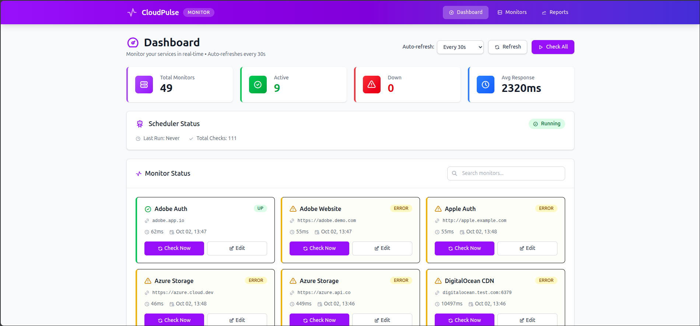

# CloudPulse Monitor 🚀

> A fast, lightweight, and beautiful uptime monitoring solution built with Vue.js and Fastify.



## ✨ Features

- 📊 **Real-time Monitoring** - Monitor HTTP, Ping, and TCP endpoints
- 🎨 **Beautiful Dashboard** - Modern UI with TailwindCSS v4
- 🔔 **Toast Notifications** - Non-intrusive alerts for all actions
- 🔍 **Smart Search** - Instant client-side filtering
- 📄 **Pagination** - Handle hundreds of monitors efficiently
- ✅ **Bulk Operations** - Select and delete multiple monitors
- 📈 **Status History** - Track uptime and response times
- 🚫 **Duplicate Prevention** - Unique constraint on URL + type
- ⚡ **Fast & Lightweight** - SQLite database, no heavy dependencies

## 🛠️ Tech Stack

**Frontend:**
- Vue 3 (Composition API)
- TypeScript
- TailwindCSS v4
- Vite 5
- Axios

**Backend:**
- Fastify (Node.js)
- SQLite (better-sqlite3)
- Node-cron (Scheduler)

## 📁 Project Structure

```
cloudpulse-monitor/
├── backend/                    # Fastify API server
│   ├── src/
│   │   ├── models/            # Database models
│   │   ├── services/          # Business logic
│   │   ├── routes/            # API endpoints
│   │   └── app.js             # Main application
│   ├── data/                  # SQLite database
│   └── package.json
├── frontend/                  # Vue.js application
│   ├── src/
│   │   ├── views/             # Page components
│   │   ├── components/        # Reusable components
│   │   ├── composables/       # Vue composables
│   │   ├── services/          # API services
│   │   └── main.ts            # Application entry
│   └── package.json
├── docker-compose.yml         # Docker orchestration
├── Dockerfile                 # Backend container
├── frontend.Dockerfile       # Frontend container
└── README.md                  # This file
```

## 🚀 Quick Start

### Prerequisites

- Node.js 18+ 
- npm or yarn

### Installation

1. **Clone the repository**
   ```bash
   git clone <repository-url>
   cd cloudpulse-monitor
   ```

2. **Install backend dependencies**
   ```bash
   cd backend
   npm install
   ```

3. **Install frontend dependencies**
   ```bash
   cd ../frontend
   npm install
   ```

4. **Start the backend** (Terminal 1)
   ```bash
   cd backend
   npm start
   # Backend runs on http://localhost:3000
   ```

5. **Start the frontend** (Terminal 2)
   ```bash
   cd frontend
   npm run dev
   # Frontend runs on http://localhost:5173
   ```

6. **Open your browser**
   ```
   http://localhost:5173
   ```

### 🐳 Docker (Alternative)

```bash
docker-compose up -d
```

Access the app at `http://localhost:3001`

---

## 📚 Development Commands

### Populate Test Data

To populate the database with 50 test monitors for development/testing:

```bash
cd backend
npm run populate
```

This will create:
- 50 realistic monitors (HTTP, Ping, TCP)
- Mixed intervals (30s, 60s, 120s, 180s, 300s)
- Realistic company names and URLs

**Note:** Restart your backend after populating to schedule the new monitors.

### Clean Up Test Data

To remove all test monitors from the database:

**Option 1: Delete all monitors**
```bash
cd backend
sqlite3 monitoring.db "DELETE FROM monitors;"
sqlite3 monitoring.db "DELETE FROM monitor_checks;"
```

**Option 2: Delete only test monitors** (keeps your real monitors)
```bash
cd backend
sqlite3 monitoring.db "DELETE FROM monitors WHERE name LIKE '% API' OR name LIKE '% Website' OR name LIKE '% CDN' OR name LIKE '% Database' OR name LIKE '% Cache' OR name LIKE '% Storage' OR name LIKE '% Auth';"
```

**Option 3: Reset entire database**
```bash
cd backend
rm data/uptime.db
# Restart backend - it will recreate the database
```

---

## 📍 Monitor Types

CloudPulse supports three types of monitoring:

### 1. HTTP/HTTPS Monitoring
- Monitors web endpoints
- Checks status codes (200, 404, 500, etc.)
- Measures response time
- **Example:** `https://api.example.com`

### 2. Ping Monitoring  
- ICMP ping to check host availability
- Measures latency
- **Example:** `google.com` or `192.168.1.1`

### 3. TCP Port Monitoring
- Checks if a TCP port is open
- Useful for databases, SSH, custom services
- **Example:** `db.example.com:3306` or `192.168.1.1:22`

---

## 💾 Database Schema

### Unique Constraints

The `monitors` table has a unique constraint on `(url, type)` to prevent duplicate monitoring:

```sql
UNIQUE(url, type)
```

**What this means:**
- ✅ You can have multiple monitors with the same name
- ✅ You can monitor the same URL with different types (e.g., HTTP and Ping)
- ❌ You cannot create two HTTP monitors for the same URL
- ❌ You cannot create two Ping monitors for the same host

**Example:**
```
✅ Name="Production", URL="https://api.com", Type="http"
✅ Name="Backup", URL="https://api.com", Type="ping"  (different type)
❌ Name="Secondary", URL="https://api.com", Type="http"  (duplicate)
```

**Migration Note:**
If you have an existing database, you'll need to recreate it to apply the unique constraint:
```bash
cd backend
rm data/uptime.db
npm start  # Will recreate with new schema
```

---

## 🎯 Key Features Explained

### 🔔 Toast Notifications
All actions (create, update, delete, errors) show beautiful toast notifications instead of browser alerts. Auto-dismiss after 10 seconds with manual close option.

### 🔍 Search & Filter
Instant client-side search across monitor names and URLs. No API calls, lightning-fast results.

### 📄 Smart Pagination
- **Dashboard:** 12 monitors per page (4 rows × 3 columns)
- **Monitors Page:** 20 monitors per page
- Auto-resets to page 1 when searching
- Only shows when needed

### ✅ Bulk Operations
Select multiple monitors with checkboxes and delete them all at once. Parallel deletion for speed.

### 🚫 Duplicate Prevention
Unique constraint on `(url, type)` prevents monitoring the same endpoint twice. Clear error messages guide users.

### 📊 Real-time Status
Color-coded status badges:
- 🟢 **Green** - Up
- 🔴 **Red** - Down  
- 🟡 **Yellow** - Error
- ⚪ **Gray** - Unknown

---

## 🔌 API Endpoints

### Monitors
```
GET    /api/monitors           # Get all monitors
GET    /api/monitors/:id       # Get single monitor
POST   /api/monitors           # Create monitor
PUT    /api/monitors/:id       # Update monitor
DELETE /api/monitors/:id       # Delete monitor
GET    /api/monitors/:id/checks # Get monitor checks
```

### Monitoring
```
POST   /api/check/:id          # Manual check
POST   /api/check-all          # Check all monitors
GET    /api/scheduler/status   # Scheduler status
```

---

## 🛠️ Configuration

### Backend (backend/src/app.js)
```javascript
// CORS origins
origin: ['http://localhost:5173', 'http://localhost:3001']

// Database path
const db = new Database('./data/uptime.db')
```

### Frontend (frontend/src/services/api.js)
```javascript
// API base URL
baseURL: 'http://localhost:3000/api'
```

---

## 📝 License

MIT

---

## 👥 Contributing

Contributions are welcome! Please feel free to submit a Pull Request.

---

**Built with ❤️ using Vue.js and Fastify**

---

## 🎯 Key Features Explained

### 🔔 Toast Notifications
All actions (create, update, delete, errors) show beautiful toast notifications instead of browser alerts. Auto-dismiss after 10 seconds with manual close option.

### 🔍 Search & Filter
Instant client-side search across monitor names and URLs. No API calls, lightning-fast results.

### 📄 Smart Pagination
- **Dashboard:** 12 monitors per page (4 rows × 3 columns)
- **Monitors Page:** 20 monitors per page
- Auto-resets to page 1 when searching
- Only shows when needed

### ✅ Bulk Operations
Select multiple monitors with checkboxes and delete them all at once. Parallel deletion for speed.

### 🚫 Duplicate Prevention
Unique constraint on `(url, type)` prevents monitoring the same endpoint twice. Clear error messages guide users.

### 📊 Real-time Status
Color-coded status badges:
- 🟢 **Green** - Up
- 🔴 **Red** - Down  
- 🟡 **Yellow** - Error
- ⚪ **Gray** - Unknown

---

## 🔌 API Endpoints

### Monitors
```
GET    /api/monitors           # Get all monitors
GET    /api/monitors/:id       # Get single monitor
POST   /api/monitors           # Create monitor
PUT    /api/monitors/:id       # Update monitor
DELETE /api/monitors/:id       # Delete monitor
GET    /api/monitors/:id/checks # Get monitor checks
```

### Monitoring
```
POST   /api/check/:id          # Manual check
POST   /api/check-all          # Check all monitors
GET    /api/scheduler/status   # Scheduler status
```

---

## 🛠️ Configuration

### Backend (backend/src/app.js)
```javascript
// CORS origins
origin: ['http://localhost:5173', 'http://localhost:3001']

// Database path
const db = new Database('./data/uptime.db')
```

### Frontend (frontend/src/services/api.js)
```javascript
// API base URL
baseURL: 'http://localhost:3000/api'
```

---

## 📝 License

MIT

---

## 👥 Contributing

Contributions are welcome! Please feel free to submit a Pull Request.

---

**Built with ❤️ using Vue.js and Fastify**